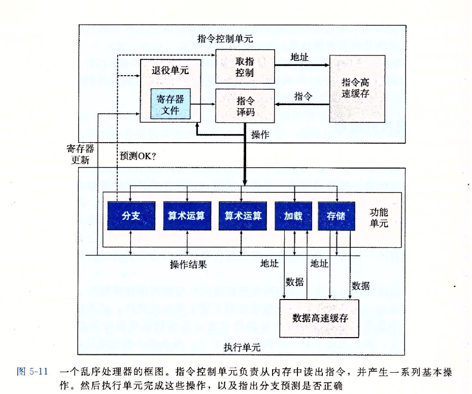

# 第五章 优化程序性能

对于程序员来说这一章的重要程度不言而喻,写的程序,`易懂且性能好`,是永恒的追求!

首先,**正确性**是必要条件,一个程序不是正确的,那一点用也没有.
在这个基础上,**我们要保证两方面:**
1. **清晰简洁**
2. **性能好,运行速度快**(这一章的重点)

在具体项目中如何看待二者呢,就看你的项目是更看重性能,还是更看重可读性和维护,具有挑战性的是尽管做了很多优化还是要保证可读性.

几种优化程序的**思路**:
1. 采用适当的**算法和数据结构**
2. **编写让编译器更容易优化的代码**,让编译器产生更高效的机器指令(有时这需要不断修改代码,比较产生的代码)
3. 将大任务划分成几个部分,**多线程执行**

本章主要针对第2点进行展开深入分析:

要优化代码:

首先是:**消除不必要的函数调用,条件测试,和内存引用**.减少冗余的逻辑和空间使用,这是最basic的.

虽然现代编译器在优化程序方面已经很优秀了,即使如此,还是有很多**妨碍编译器优化**的情况存在.

代码执行的工作流:


我们要理解编译器和处理器,写出更好的代码,让编译器更好优化,让处理器更快执行!处理器我们了解的不多,我们要多研究编译器优化并编译的技术,写出更有利于编译的代码,**不断的修改程序,研究编译出的汇编,分析性能是很必要的**.

## 优化编译器的能力和局限性

现代编译器使用了很复杂和精细的手段来编译我们的程序,用来减少相同部分的运算次数,优化表达式,减少寄存器的使用.
`gcc -Og -o hello hello.c`,`-Og`就代表了最低的编译的优化等级,可以换成`-O1`,`-O2`,`-O3`,这样优化等级会越来越高,但是对于有妨碍编译优化的代码来说,即使使用最高优化等级也不如没有妨碍编译器优化的代码,使用`-O1`的等级的高效!!

编译器会使用**最安全的优化**,也就是考虑到程序员写这段代码**所有可能得情况**,以避免优化后,程序的行为不同.

下面讨论下哪些情况下编译器并不会进行优化呢?
1. 程序可能存在**内存别名**,编译器必须假定这是有可能的,它会限制优化策略
2. **函数副作用**,比如函数内部有修改全局变量等,编译器必须假定这种情况存在

程序示例:
```c
// 1.乍一看似乎两个函数是相同的行为,但是如果xp和yp指向的内存是相同的,结果就不同了,所以编译器不能把twidle1优化成twidle2
void twidle1(long *xp, long *yp)
{
    *xp += *yp;
    *xp += *yp;
}

void twidle2(long *xp, long *yp)
{
    *xp += 2 * *yp;
}

// 2.函数的副作用
long f();

long func1()
{
    return f() + f() + f() + f();
}

long func2()
{
    return f() * 4;
}

// 乍一看好像二者执行结果是相同的,但是如果f()是这样的,func1和fun2的返回值就不同了,所以不能把fun1优化成fun2
long counter = 0;
long f()
{
    return counter++;
}
```

>对于函数调用产生的副作用可以怎么消除呢?使用内联函数
内联函数,就是调用到的地方直接插入函数体的代码,不再进行函数调用,也就会省去一些函数调用的开销,也可以对内联插入函数体后的代码进一步优化.一般只用内联来进行一些短小的简单操作,不用来替换什么复杂的程序(例如循环).
只需要在函数前面加上`inline`就可以定义成内联的了,但是目前只能在单个文件内部使用内联函数,外部使用不生效.
注意在一些gdb或者代码剖析程序中,内联替换过的程序无法正常操作.

从优化程序方面,GCC是胜任的,但是它并不是有进取心的,所以我们要花费更多的精力配合GCC生成更高效的代码.

## 表示程序性能
引入`每元素周期数 CPE (Cycle Per Element, CPE)`作为一种表示程序性能,以及改进代码的方法.它能够帮助我们在更细节的方面理解循环性能.

例如,对于`前置和`的计算:
前置和的定义:
    `S0 = a0, Sn = S(n - 1) + an`
```c
/* compute prefix sum of vector a */
void psum1(float a[], float p[], long n)
{
    long i;
    p[0] = a[0];
    for (i = 1; i < n; i++) {
        p[i] = p[i - 1] + a[i];
    }
}

void psum2(float a[], float p[], long n)
{
    long i;
    p[0] = a[0];
    for (i = 0; i < n - 1; i+=2) {
        float mid_val = p[i - 1] + a[i];
        p[i] = mid_val;
        p[i + 1] = mid_val + a[i + 1];
    }
    /* For even n, finish remaining element */
    if (i < n) {
        p[i] = p[i - 1] + a[i];
    }
}
```
PS: 这里psum2用来一种被称作`循环展开`的优化技术,该技术可以提升性能.
psum1的CPE是9.0, psum2的CPE是6.0.

## 消除循环的低效率
查看下面两个段代码:
```c
long val_length(vec_ptr v) {
    return v->len;
}

void combine1(vec_ptr v, data_t *dest)
{
    long i;
    *dest = IDENT;
    /* 注意下面循环条件包含函数,这会导致每次循环都调用一次这个函数,造成低效率 */
    for (i = 0; i < vec_length(v); i++) {
        data_t val;
        get_vec_element(v, i , &val);
        *dest = *dest OP val;
    }
}
```

```c
/* 这个例子更说明问题:转换大小写 */
void lower1(char *s)
{
    long i;
    /* 注意下面循环条件包含strlen(s),这会导致每次循环都调用一次,造成严重低效率,要知道strlen是通过类似循环遍历得到的长度,复杂度O(n),这样一来整个程序复杂度将会变成O(n^2) */
    for (i = 0; i < strlen(s); i++) {
        if (s[i] >= 'A' && s[i] <= 'Z') {
            s[i] -= ('A' - 'a');
        }
    }
}
```

对于combine1,每次循环都会调用vec_length,造成不必要的函数开销,由于vec_length执行不复杂,影响不是太大;对于lower1更是在循环条件中加入了时间复杂度为O(n)的strlen,造成了严重低效,当字符串的长度达到百万级别,lower1可能会执行10min以上!而移除循环,执行的速度将会快50万倍,不到1s就执行完了.
以上把函数放在循环条件中都是不必要的,因为,循环过程中,如果这些函数条件的值是不变的.都需要把函数条件放在循环外边(反之,如果这些函数在循环过程中被改变,就需要每次计算,但是这种情况一般比较少见).
那么为什么编译器没有优化这块呢?因为编译器无法准确判断这些函数有没有副作用(字符串被修改/修改全局变量等等),所以无法优化.
一个有经验的程序员应该避免这样的低效率代码出现!

## 减少过程调用
这一部分讲的就是消除不必要的函数调用或者逻辑,消除冗余的函数调用或者逻辑.

书中的例子:
中间涉及到了一个函数,含有对一个参数的判断,但是在例子调用前已经保证了该参数的判断是true,被认为是冗余的,但是用代码优化后(新加了一个不需要判断该参数的接口),效率未明显提升,为什么没有提升,书中后面讲解.后续会优化有提升.

## 减少不必要的内存引用
程序中的*point,也就是对指针解引用,这个操作在底层就是访存,如果在循环中每次都要对某个地址访存,而这个变量的值是可以不访存,通过设置另外一个变量(这样就会用到寄存器存储这个变量)拿到,就会减少内存引用,节约效率.

怎么理解呢?
```c
// 下面的程序每次循环体都要访存一次,但是实际*var的值在上次循环就访存+计算拿到了,为什么每次都要访存呢?冗余内存引用
void func(..., data_t *var)
{
    ...;
    for (...) {
        *var = *var + a[i];
    }
}

// 改为下面:不影响程序逻辑的情况下,减少不必要的内存引用,这个日常要注意,*var就是访存,可能要读写内存
void func(..., data_t *var)
{
    ...;
    data_t temp;
    for (...) {
        temp = temp + a[i];
    }
    *var = temp;
}
```
书中经过减少内存的引用,CPE得到提升.

## 理解现代处理器

