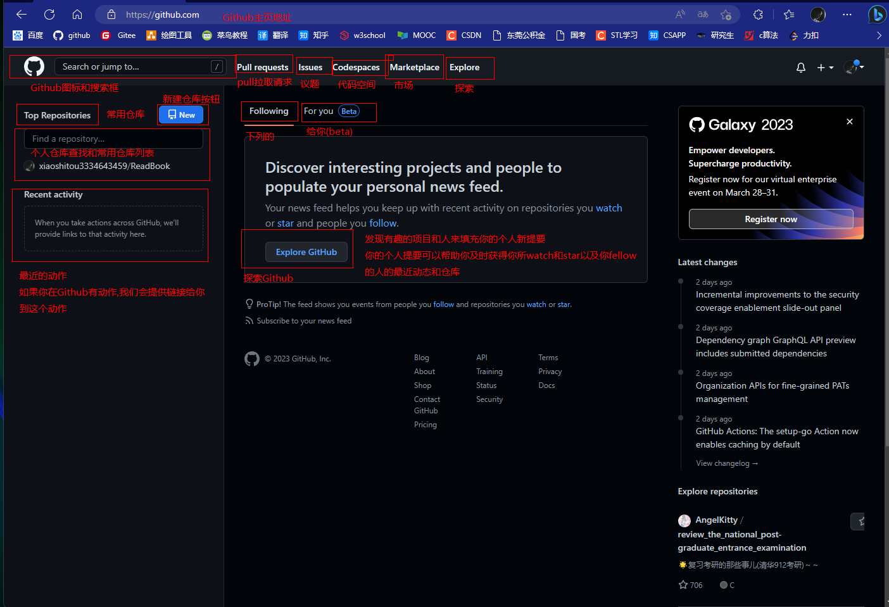
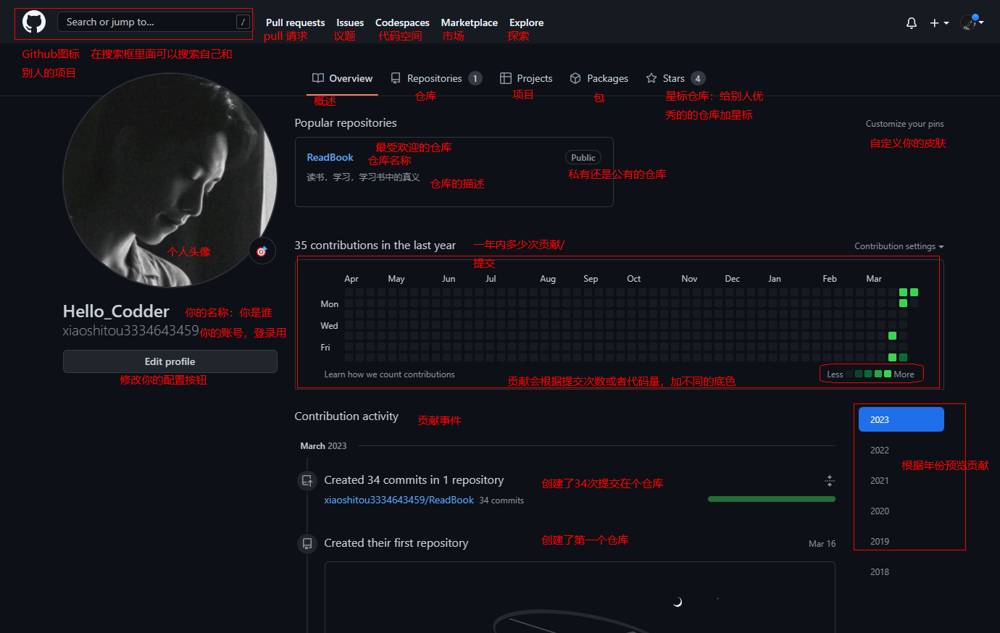

# Github探索

## 熟悉Github
* Github主页:

* 我的主页
  

## github小知识点
* 如何参与开源项目
1. 首先必须fork开源项目，这代表你复制了一份开源项目到你的仓库，此时你修改复制的项目，和原始项目无关
2. 你修改验证完毕后，可以点击pull request推送到原始项目，原始项目的主人审核后，其可以选择合并你的修改

* 什么是issues?
  issues相当于，使用者和开发者讨论的一个窗口，使用者或者开发者都可以新建一个issues去讨论bug或者功能，开发者回复解决后，可以选择关闭这个issues.

* 一些术语的意思？
  Star 星标，也是收藏，或者点赞
  watch 关注，关注后，项目的变动会在主页显示
  fork  复制项目
  贡献度格子颜色：五种颜色分别对应 0、1–3、4–7、8–11、12+ 次贡献。这个贡献包括提交代码、开 issue、发 PR、给 PR 做 code review